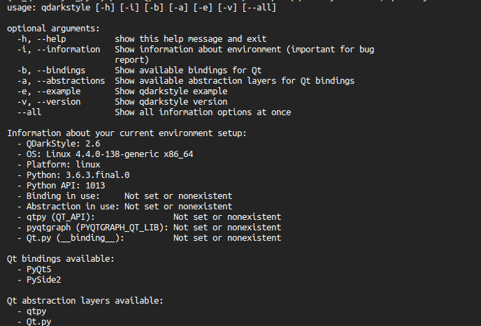
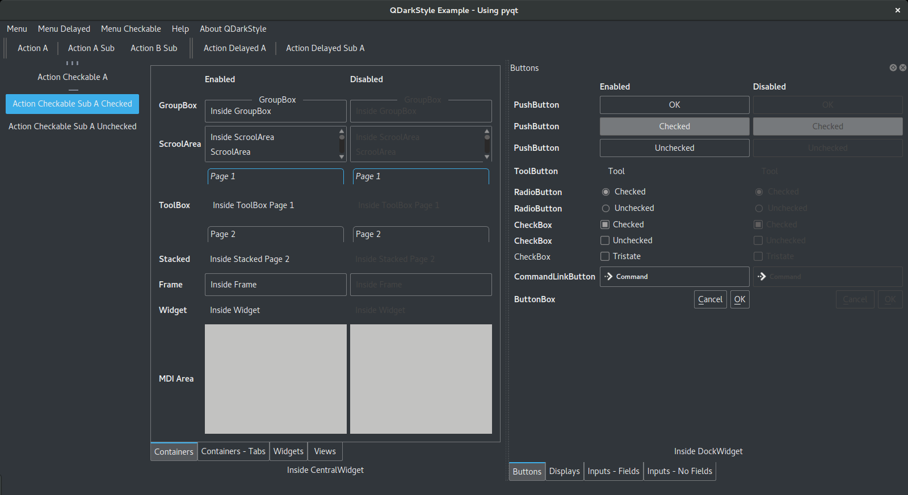
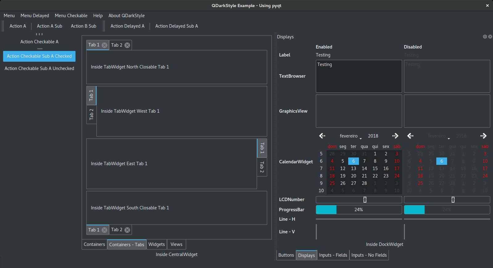
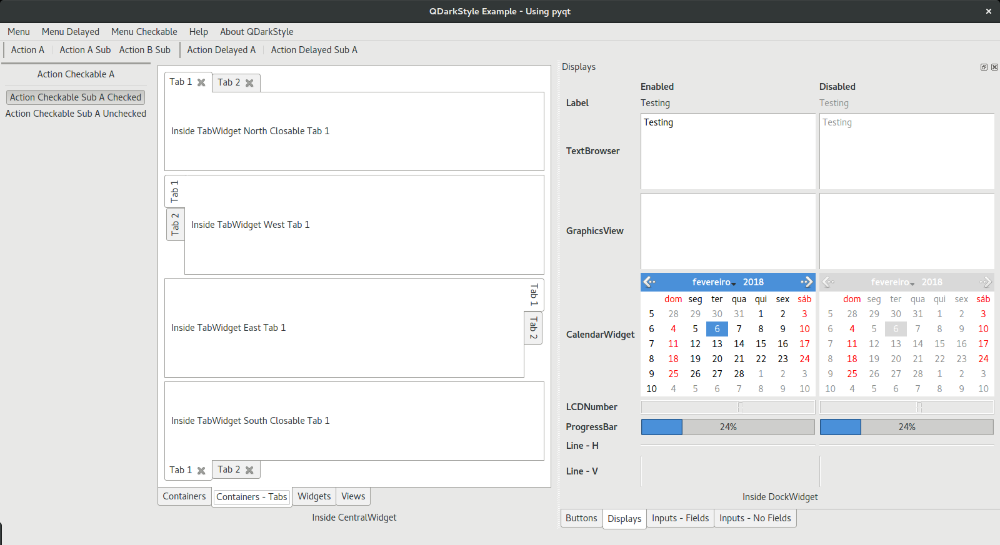
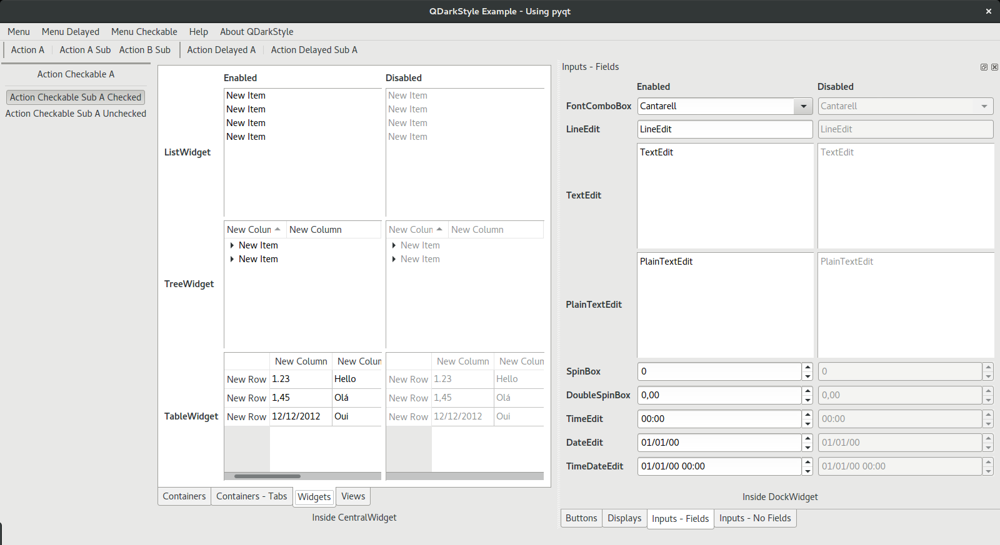
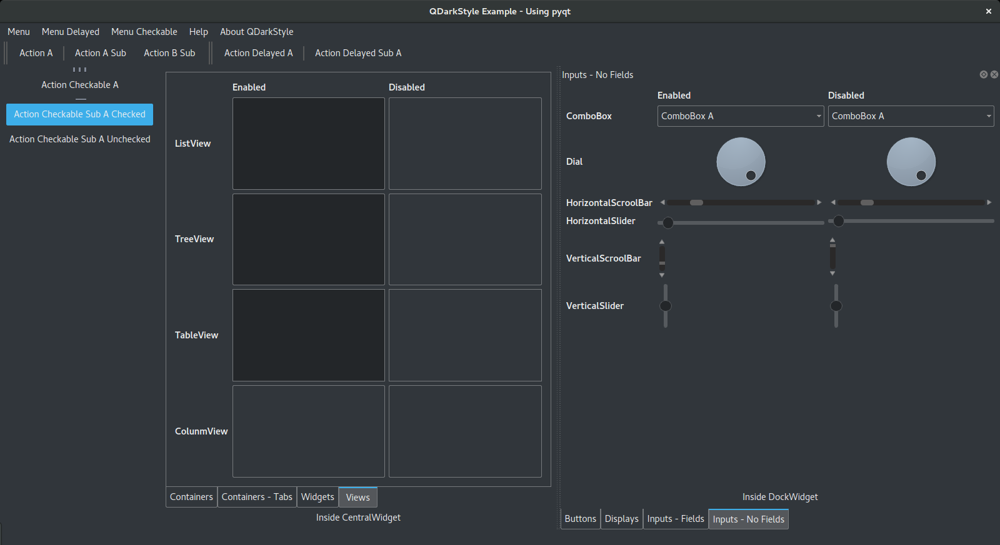
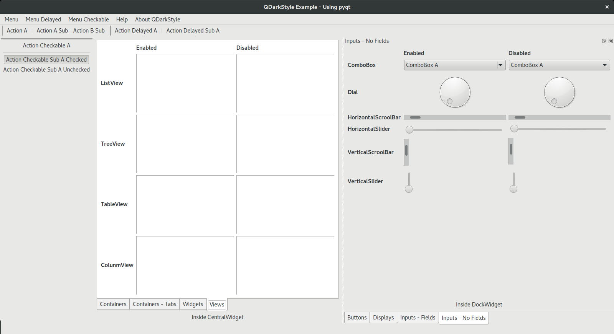

# QDarkStylesheet

[](https://travis-ci.org/ColinDuquesnoy/QDarkStyleSheet)
[](https://pypi.python.org/pypi/QDarkStyle)
[](https://opensource.org/licenses/MIT)
[](https://creativecommons.org/licenses/by/4.0/)
[](http://contributor-covenant.org/version/1/4/)


A dark stylesheet for Qt applications (Qt4, Qt5, PySide, PySide2, PyQt4, PyQt5, QtPy,
PyQtGraph).

## Installation

### Python

From PyPI: Get the latest stable version of ``qdarkstyle`` package
using *pip* (preferable):

```bash
pip install qdarkstyle
```

From code: Download/clone the project, go to ``qdarkstyle`` folder then:

- You can use the *setup* script and pip install.
    ```bash
    pip install .
    ```

- Or, you can use the *setup* script with Python:
    ```bash
    python setup.py install
    ```

### C++

- Download/clone the project and copy the following files to your application
  directory (keep the existing directory hierarchy):

  - **qdarkstyle/style.qss**
  - **qdarkstyle/style.qrc**
  - **qdarkstyle/rc/** (the whole directory)

- Add **qdarkstyle/style.qrc** to your **.pro file** as follows:

  ```cpp
  RESOURCES += qdarkstyle/style.qrc
  ```
- Load the stylesheet:

  ```cpp
  QFile f(":qdarkstyle/style.qss");
  if (!f.exists())
  {
      printf("Unable to set stylesheet, file not found\n");
  }
  else
  {
      f.open(QFile::ReadOnly | QFile::Text);
      QTextStream ts(&f);
      qApp->setStyleSheet(ts.readAll());
  }
  ```

_Note: The ":" in the file name is necessary to define that file as a resource library. For more information see the discussion [here](https://github.com/ColinDuquesnoy/QDarkStyleSheet/pull/87)._

## Usage

Here is an example using PySide

```Python
import sys
import qdarkstyle
from PySide import QtGui

# create the application and the main window
app = QtGui.QApplication(sys.argv)
window = QtGui.QMainWindow()

# setup stylesheet
app.setStyleSheet(qdarkstyle.load_stylesheet_pyside())

# run
window.show()
app.exec_()
```

To use another wrapper for Qt, you need to replace some lines.
See examples below.

To use PyQt4, change two lines

```Python
from PySide import QtGui
app.setStyleSheet(qdarkstyle.load_stylesheet_pyqt())
```

If PyQt5, more lines need to be changed because of its API,
see the complete example

```Python
import sys
import qdarkstyle
from PyQt5 import QtWidgets

# create the application and the main window
app = QtWidgets.QApplication(sys.argv)
window = QtWidgets.QMainWindow()

# setup stylesheet
app.setStyleSheet(qdarkstyle.load_stylesheet_pyqt5())

# run
window.show()
app.exec_()
```

If your project uses QtPy or you need to set it programmatically,
it is far more simple

```Python
import sys
import qdarkstyle
import os

# set the environment variable to use a specific wrapper
# it can be set to pyqt, pyqt5, pyside or pyside2 (not implemented yet)
# you do not need to use QtPy to set this variable
os.environ['QT_API'] = 'pyqt'

# import from QtPy instead of doing it directly
# note that QtPy always uses PyQt5 API
from qtpy import QtWidgets

# create the application and the main window
app = QtWidgets.QApplication(sys.argv)
window = QtWidgets.QMainWindow()

# setup stylesheet
app.setStyleSheet(qdarkstyle.load_stylesheet_from_environment())

# run
window.show()
app.exec_()
```

It is also simple if you use PyQtGraph

```Python
import sys
import qdarkstyle
import os

# set the environment variable to use a specific wrapper
# it can be set to PyQt, PyQt5, PySide or PySide2 (not implemented yet)
os.environ['PYQTGRAPH_QT_LIB'] = 'PyQt'

# import from pyqtgraph instead of doing it directly
# note that PyQtGraph always uses PyQt4 API
from pyqtgraph.Qt import QtGui

# create the application and the main window
app = QtGui.QApplication(sys.argv)
window = QtGui.QMainWindow()

# setup stylesheet
app.setStyleSheet(qdarkstyle.load_stylesheet_from_environment(is_pyqtgraph=True))

# run
window.show()
app.exec_()
```

If you are using Qt.py, which is different from qtpy, you should install
qtpy then set both to the same binding.

_There is an example included in the *example* folder.
You can run the script without installing qdarkstyle. You only need to have
PySide or PySide2 or PyQt4 or PyQt5 installed on your system._


## What is new?

In the version 2.6 and later, a reestructure stylesheet is provided. The palette has only 9 colors. Most widgets are revised and their styles were improved. We also provide a command line (script) to get info that could be used when opening issues. See the image below.

```
qdarkstyle --all
```




## Snapshots

Here are a few snapshots comparing the use of QDarkStyle v2.6.1 and the default style.
Click in the image to zoom.

<table style="width:100%">
  <tr>
    <th colspan=2>Containers (no tabs) and Buttons</th>
  </tr>
  <tr>
    <td></td>
    <td></td>
  </tr>
  <tr>
    <th colspan=2>Containers (tabs) and Displays</th>
  </tr>
  <tr>
    <td></td>
    <td></td>
  </tr>
  <tr>
    <th colspan=2>Widgets and Inputs (fields)</th>
  </tr>
  <tr>
    <td></td>
    <td></td>
  </tr>
  <tr>
    <th colspan=2>Views and Inputs (no fields)</th>
  </tr>
  <tr>
    <td></td>
    <td></td>
  </tr>
</table>

## Changelog

Please, see [CHANGES](CHANGES.md) file.

## License

This project is licensed under the MIT license.
Images contained in this project are licensed under CC-BY license.

For more information see [LICENSE](LICENSE.md) file.

## Authors

For more information see [AUTHORS](AUTHORS.md) file.

## Contributing

Most widgets have been styled. If you find a widget that has not been
style, just open an issue on the issue tracker or, better, submit a pull
request.

If you want to contribute, see [CONTRIBUTING](CONTRIBUTING.md) file.
